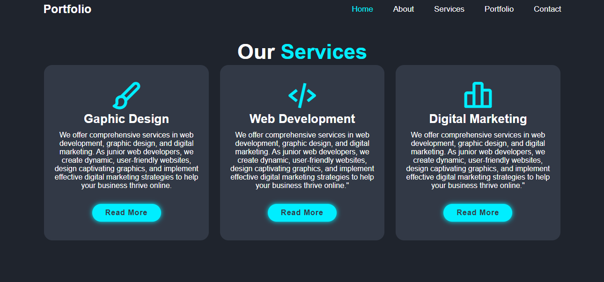

# PORTFOLIO
## Portfolio page (Mehria Saqibi) 🚀

## Project Description 📝
Welcome to Mehria Saqbi's professional portfolio. This site showcases my work as a junior web developer, highlighting the projects I have completed and the skills I possess. The portfolio features a modern and sleek design with smooth animations, enhancing user experience and engagement

## Demo 📸

Include a demo or animated GIF of your project. You can use tools like [asciinema](https://asciinema.org/) to record your terminal sessions.





## Technologies Used 🛠️


- HTML
- CSS
## Installation 💻

Folow these steps to set up the project on your local machine 
Ensure you have the following software installed on your machine

```bash
#git clone
```

```bash
#git@github.com:Saqibi4213/my-portfolio.git
```

## Usage 🎯

you can access to my project through git clone 
-git clone the HTTP or My SSH code link from the repository you wat to clone 

``` 
# git clone
```

## Features ⭐

Certainly! Here's a list of features added to your professional portfolio:
<br />

1. *Responsive Design*: The portfolio is fully responsive, ensuring an optimal viewing experience across different devices and screen sizes.
<br />
2. *Smooth Animations*: Transitions and animations enhance the user experience, providing a dynamic and engaging interface.
<br />
3. *Navigation Bar*: A fixed navigation bar allows easy access to different sections of the portfolio, such as About, Projects, and Contact.
<br />
4. *Welcome Section*: An introductory section with a headline and a brief description of who you are and what you do.
<br />
5. *Projects Gallery*: A visually appealing grid layout showcasing your projects with images and titles. Each project link opens in a new tab.
<br />
6. *Project Descriptions*: Each project is presented with an image and a brief description, giving visitors an overview of your work and skills.


## Author 👩‍💻

Mehria Saqibi 
 <br>
 Email: mosawermh@gmail.com
 <br>
 LinkedIn: [Mheria saqibi] https://www.linkedin.com/in/mheria-saqibi-a386a41a1?utm_source=share&utm_campaign=share_via&utm_content=profile&utm_medium=android_app

## Contributing 🤝

We welcome contributions from the community! Please follow the guidelines below to contribute to our project.
<br />
1: Fork the Repository: Click the "Fork" button at the top right of the repository page to create a copy of the repository on your GitHub account.
<br />
2: Clone Your Fork: Clone your forked repository to your local machine using the following command:git clone https://github.com/yourusername/yourprojectname.git
<br />
3: Create a Branch: Create a new branch for your work to ensure your changes are isolated from the main branch:git checkout -b feature-or-bugfix-description
<br />
4: Make Your Changes: Implement your changes, whether fixing a bug or adding a new feature. Be sure to follow the project's coding standards and guidelines.
<br />
5: Commit Your Changes: Commit your changes with a descriptive commit message:git add .
git commit -m "Description of the changes"
<br />
6: Push to Your Fork: Push your changes to your forked repository:git push origin feature-or-bugfix-description
<br />
7: Submit a Pull Request: Go to the original repository and submit a pull request from your forked repository. Provide a clear and concise description of your changes and why they should be merged..

## License 📜

